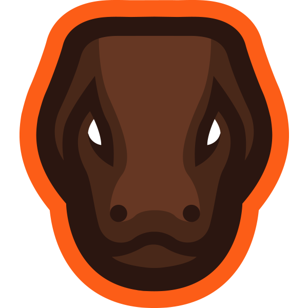

<!-- PROJECT LOGO -->
<br />
<p align="center">
  <a href="https://github.com/dionpirotta/ProjectParallel">
    
  </a>

  <h3 align="center">Komodo's Custom CS:GO HUD</h3>

  <p align="center">
    Built for use with the
    <br />
    <a href="https://github.com/lexogrine/hud-manager"><strong>Lexogrine HUD Manager »</strong></a>
    <br />
  </p>
</p>

<!-- TABLE OF CONTENTS -->

## Table of Contents

- [About the Project](#about-the-project)
- [Getting Started](#getting-started)
  - [Prerequisites](#prerequisites)
  - [Installation](#installation)
- [Usage](#usage)
  - [Keybinds](#keybinds)
- [Contributing](#contributing)
- [License](#license)
- [Contact](#contact)
- [Acknowledgements](#acknowledgements)

<!-- ABOUT THE PROJECT -->

## About The Project

This Project is my custom HUD for the Lexogrine HUD Manager.

<!-- GETTING STARTED -->

## Getting Started

To get a local copy up and running follow these simple steps.

### Prerequisites

This is an example of how to list things you need to use the software and how to install them.

- npm packages

```sh
npm install npm@latest -g
```

```sh
npm install -g tsc concurrently
```

```sh
npm install --save-dev typescript
```

### Installation

- Clone the Komodo-React-HUD

```sh
git clone https://github.com/dionpirotta/ProjectParallel.git
```

- Install NPM packages

```sh
npm install
```

- NPM Start

```sh
npm run start
```

<!-- USAGE -->

## Usage

- **Edit hud.json and HUD image**
  In `/public` directory, edit the hud.json file with all your information. Replace thumb.png with your icon (this is what shows in the HUD Manager)
- **Compile**

```sh
npm run pack
```

This will create a zip file for you to drag into the HUD Manager

<!-- KEYBINDS -->

## Keybinds

- Left Alt + S

  > Makes the Radar 20px Smaller

- Left Alt + B

  > Makes the Radar 20px Bigger

- Left Alt + T

  > Shows the Trivia Box

- Left Ctrl + B
  > Makes Radar Invisible
  
- Left Ctrl + U
  > Toggle Minimal HUD
  
## Display Settings

- Type in Left box's title/subtitle, or right box's title/subtitle
  > Will display text and image (if applicable)

- Type 'hide' in Left box's title or Right box's title
  > Will hide the box
  
- Type 'image' in Left box's title or Right box's title
  > Will use the image centered in the box (best practice is to fill the whole box in your image)

<!-- CONTRIBUTING -->

## Contributing

Contributions are what make the open source community such an amazing place to be learn, inspire, and create. Any contributions you make are **greatly appreciated**.

1. Fork the Project
2. Create your Feature Branch (`git checkout -b feature/MyAwesomeHUD`)
3. Commit your Changes (`git commit -m 'Created MyAwesomeHUD'`)
4. Push to the Branch (`git push origin feature/MyAwesomeHUD`)
5. Open a Pull Request

<!-- LICENSE -->

## License

Distributed under the GPL-3 License. See `LICENSE` for more information.

<!-- CONTACT -->

## Contact

Dion Pirotta - [@KomodoAU](https://twitter.com/KomodoAU) - komodoau@hotmail.com

Project Link: [https://github.com/dionpirotta/ProjectParallel](https://github.com/dionpirotta/ProjectParallel)

<!-- ACKNOWLEDGEMENTS -->

## Acknowledgements

- [osztenkurden](https://github.com/osztenkurden)

<!-- MARKDOWN LINKS & IMAGES -->